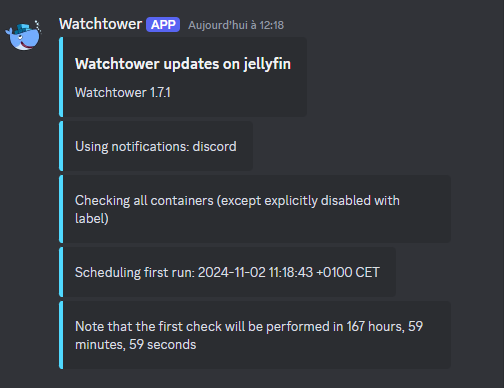

# Watchtower avec Docker Compose

## Introduction to Watchtower

Watchtower is a tool that automatically updates Docker containers when a new image is available. This is particularly useful for keeping your services up to date without manual intervention.

## Benefits of Watchtower

- **Automation**: Automatically updates Docker containers.
- **Security**: Ensures containers use the latest image versions, including security patches.
- **Simplicity**: Easy to configure and use with Docker Compose.

## Usage with Docker Compose

Here is an example `docker-compose.yml` file to use Watchtower:

```yaml
services:
    watchtower:
        image: containrrr/watchtower:latest
        container_name: watchtower
        environment:
            - PUID=1000
            - PGID=1000
            - TZ=Europe/Paris
            - WATCHTOWER_POLL_INTERVAL=604800
            - WATCHTOWER_CLEANUP=true
            - WATCHTOWER_INCLUDE_STOPPED=true
            - WATCHTOWER_REVIVE_STOPPED=false
            - WATCHTOWER_NOTIFICATIONS=shoutrrr
            - WATCHTOWER_NOTIFICATION_URL=discord://token@idWebhook #send notifications to discord
        volumes:
            - /var/run/docker.sock:/var/run/docker.sock
        network_mode: host
        restart: unless-stopped
```

## Configuration

- **WATCHTOWER_CLEANUP**: Removes old images after updating.
- **WATCHTOWER_POLL_INTERVAL**: Time interval (in seconds) between update checks.

## Starting

To start Watchtower with Docker Compose, use the following command:

```sh
docker-compose up -d
```

This will launch Watchtower in the background and start monitoring container updates.

## Example of Discord Notification



## Example of Watchtower Logs

This shows that everything is working correctly 😁

```sh
watchtower  | time="2024-10-26T11:50:07+02:00" level=info msg="Watchtower 1.7.1"
watchtower  | time="2024-10-26T11:50:07+02:00" level=info msg="Using notifications: discord"
watchtower  | time="2024-10-26T11:50:07+02:00" level=info msg="Checking all containers (except explicitly disabled with label)"
watchtower  | time="2024-10-26T11:50:07+02:00" level=info msg="Scheduling first run: 2024-10-26 11:50:37 +0200 CEST"
watchtower  | time="2024-10-26T11:50:07+02:00" level=info msg="Note that the first check will be performed in 29 seconds"
watchtower  | time="2024-10-26T11:50:49+02:00" level=info msg="Found new linuxserver/qbittorrent:latest image (6c3b6525afc6)"
watchtower  | time="2024-10-26T11:51:03+02:00" level=info msg="Found new lscr.io/linuxserver/sonarr:latest image (c709862c93ab)"
watchtower  | time="2024-10-26T11:51:15+02:00" level=info msg="Found new lscr.io/linuxserver/radarr:latest image (8e0c38c89940)"
watchtower  | time="2024-10-26T11:51:25+02:00" level=info msg="Found new lscr.io/linuxserver/prowlarr:latest image (5e33f5354db2)"
watchtower  | time="2024-10-26T11:51:34+02:00" level=info msg="Found new vaultwarden/server:latest image (132bbed157fd)"
watchtower  | time="2024-10-26T11:51:34+02:00" level=info msg="Stopping /prowlarr (712adc31b10c) with SIGTERM"
watchtower  | time="2024-10-26T11:51:38+02:00" level=info msg="Stopping /radarr (1c705d00a911) with SIGTERM"
watchtower  | time="2024-10-26T11:51:42+02:00" level=info msg="Stopping /sonarr (8cb182770c3a) with SIGTERM"
```

## Next Step

- Monitor logs in Grafana and create beautiful dashboards.

