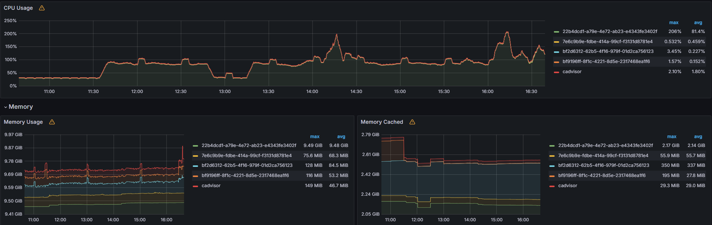
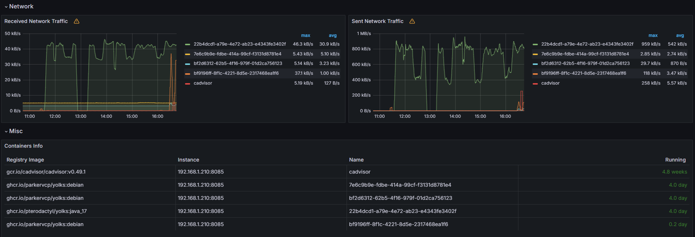

# What is Cadvisor?
Cadvisor is a tool that allows you to monitor your containers. It's a simple tool that can be used with Docker, LXC, and other container technologies. It's a tool that can be used to monitor the performance of your containers and the resources they are using. It can be used to monitor the CPU, memory, disk, and network usage of your containers. It can also be used to monitor the health of your containers and to alert you if there are any issues with your containers.

# How to use Cadvisor?
To use Cadvisor, you need to have Docker installed on your system. You can install Docker by following the instructions on the Docker website. Once you have Docker installed, you can use the following command to run Cadvisor:

```bash
VERSION=v0.49.1 # use the latest release version from https://github.com/google/cadvisor/releases
sudo docker run \
  --volume=/:/rootfs:ro \
  --volume=/var/run:/var/run:ro \
  --volume=/sys:/sys:ro \
  --volume=/var/lib/docker/:/var/lib/docker:ro \
  --volume=/dev/disk/:/dev/disk:ro \
  --publish=8080:8080 \
  --detach=true \
  --name=cadvisor \
  --privileged \
  --device=/dev/kmsg \
  gcr.io/cadvisor/cadvisor:$VERSION
```

This command will run Cadvisor in a Docker container and expose it on port 8080. You can access Cadvisor by navigating to `http://localhost:8080` in your web browser.

## Preview 

Here is a preview of the Cadvisor dashboard:


