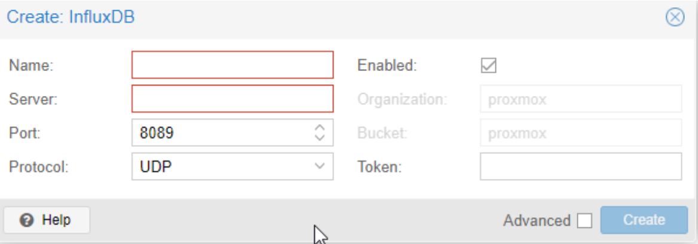
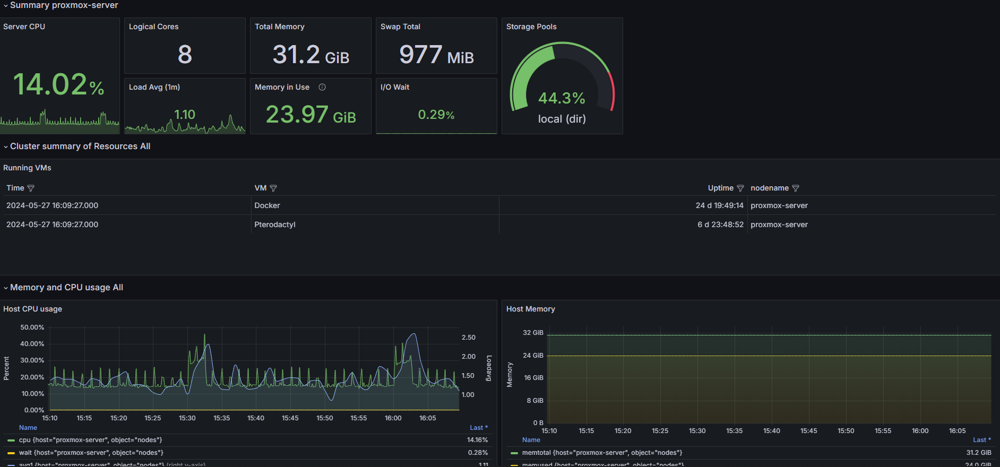

## How to monitor Proxmox with Grafana ?

1) Firstable, you need to have an Influx Database

There is a `docker-compose.yml` with Grafana and InfluxDB in this repository.

```docker
version: "3"
services:
    grafana:
        image: grafana/grafana
        container_name: grafana_container
        restart: always
        ports:
            - 3000:3000
        networks:
            - monitoring_network
        volumes:
            - grafana-volume:/var/lib/grafana
    influxdb:
        image: influxdb
        container_name: influxdb_container
        restart: always
        ports:
            - 8086:8086
            - 8089:8089/udp
        networks:
            - monitoring_network
        volumes:
            - influxdb-volume:/var/lib/influxdb
networks:
    monitoring_network:
volumes:
    grafana-volume:
        external: true
    influxdb-volume:
        external: true
``` 

Now, create volume and network with the following commands:\
*I pray the gods of Docker to forgive me for my sins*
```bash
docker volume create influxdb-volume
docker volume create grafana-volume
docker network create monitoring_network
```

Then, run the `docker-compose.yml` with the following command:
```bash
docker-compose up -d
```
2) Now, you need to have an API Key, Organization and Bucket in InfluxDB.\
You will found every thing in Internet, but here is a [little help](https://docs.influxdata.com/influxdb/v2/admin/buckets/create-bucket/).


3) Now, we'll connect Proxmox to InfluxDB.\
So you just need go to your Proxmox GUI, then go to `Datacenter` > `Metric Server` > `Add` > `InfluxDB` and fill the form with your InfluxDB informations.




## Preview

Here is a preview of the Proxmox Cluster dashboard:

