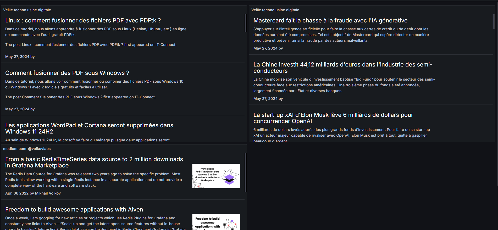
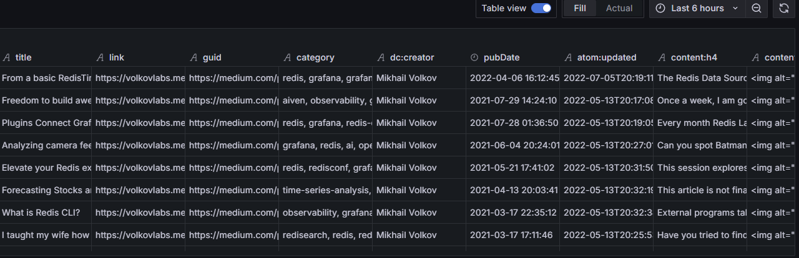

## Explanation of the RSS Dashboard

What is RSS ? 
RSS stands for Really Simple Syndication. It is a web feed format used to publish frequently updated content, such as blog posts, news articles, and podcasts. RSS allows users to subscribe to websites and receive updates in a standardized format. It is commonly used by news websites, blogs, and content aggregators.

The RSS Dashboard is a Grafana dashboard that displays RSS feeds from various sources. It allows users to view the latest headlines and articles from their favorite websites in one place. The dashboard is customizable, allowing users to add or remove feeds as needed.

1) Firstable, you need to add RSS/Atom to your `Data Sources` in Grafana.\
`ip:port/connections/datasources/volkovlabs-rss-datasource`\
Then, you need to add the URL of the RSS/Atom feed you want to display in the dashboard.

2) Now, you need to create a new dashboard in Grafana.\

3) Add a new panel to the dashboard and select the `VolkovLabs RSS` data source.\
Then, you can customize the panel to display the RSS feed in the desired format.

## Preview 




## IMPORTANT

Every RSS feed need a special content and you need to set `Dynamic Text`in the visualization panel.\
You need to create a custom content display for each RSS feed.

There is a example of content display : 

```html	
<table width="100%" style="border:0">
  <tr>
    <td style="border:0">
      <h3><a target="_blank" style="color: white;" href="{{link}}">{{title}}</a></h3>
      {{{content:h4}}}
    </td>
    <td rowspan="2" style="border:0" width="200px">
      <div style="max-width: 100%; display: inline; height: auto;"></div>
    </td>
  </tr>
  <tr>
    <td style="border:0">
      <b>{{date pubDate 'MMM, DD YYYY'}} by {{dc:creator}}</b>
    </td>
  </tr>
</table>
```

If you want to do this easily, you can check what RSS will return. Just check `Table View` in the visualization panel and you will see what RSS will return.


There is a example of RSS Table View

