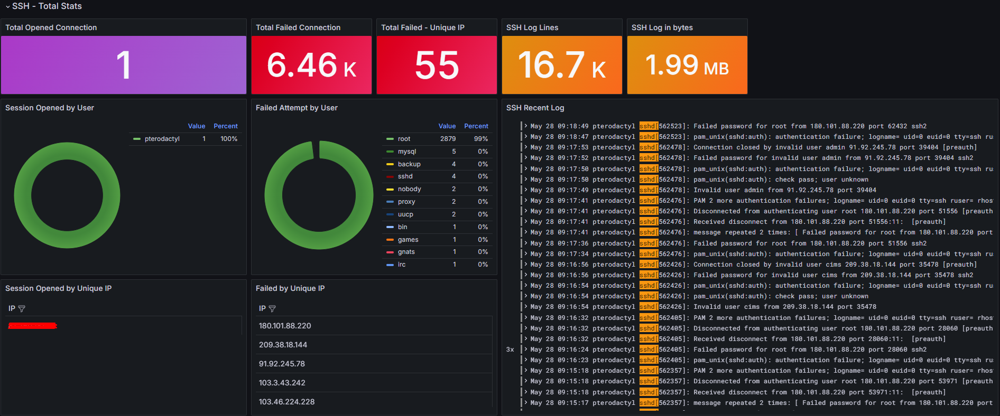

## Explanation

In other Dashboard, we just use Prometheus or some Data Source to get the data. But in this Dashboard, we use the logs to get the data. We use the Loki to get the logs and then use the logs to get the data.

## How to use

1. First, you need to install the Loki and Promtail. You can refer to the [Loki](https://grafana.com/docs/loki/latest/installation/) and [Promtail](https://grafana.com/docs/loki/latest/clients/promtail/installation/) installation guide.


2. Then, you need to configure the Promtail to get the logs. You can refer to the [Promtail Configuration](https://grafana.com/docs/loki/latest/clients/promtail/configuration/) guide.

There is a schema to explain Promtail and Loki with Grafana :


## Promtail Configuration

Here is an example of Promtail configuration :

```yaml
server:
  http_listen_port: 9080  # Promtail listen port
  grpc_listen_port: 0

positions:
  filename: /tmp/positions.yaml

clients:
  - url: http://localhost:3100/loki/api/v1/push  # Loki target instance

scrape_configs: # The most important part
  - job_name: system
    static_configs:
      - targets:
          - localhost  # Promtail target is localhost
        labels:
          instance:   # Label identifier for instance (hostname -f)
          env:   # Environment label
          job: secure  # Job label
          __path__: /var/log/secure
```

## Loki Configuration

Here is an example of Loki configuration :

```yaml
limits_config:
    max_query_parallelism: 2
    max_query_series: 100000 # Add this line very important to avoid the error "query is too large"
    reject_old_samples: true
    reject_old_samples_max_age: 168h
    retention_period: 360h
```	


## Preview
### Disclaimer
I know there are public IP in the logs. There are just bots which scan IPV4 on the Internet.

