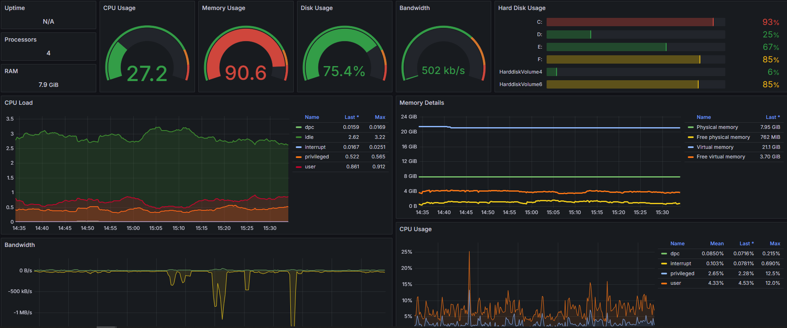

# Presentation

To get some metrics, you need to have an exporter like *Windows_Exporter* and a *Prometheus Server*.\
Prometheus will scrap datas on your client and  Grafana will display them.

## How to do this ?

Firstable, you need to download the [Windows Exporter](https://github.com/prometheus-community/windows_exporter/releases) and install it on your Windows Server.\
Then, you need to configure your Prometheus server to scrap the Windows Exporter.\
Finally, you need to configure Grafana to display the metrics.

There is a command to configure your windows exporter:
```bash
msiexec /i windows_exporter-0.16.0-amd64.msi ENABLED_COLLECTORS="ad,adfs,cache,cpu,cpu_info,cs,container,dfsr,dhcp,dns,fsrmquota,iis,logical_disk,logon,memory,msmq,mssql,netframework_clrexceptions,netframework_clrinterop,netframework_clrjit,netframework_clrloading,netframework_clrlocksandthreads,netframework_clrmemory,netframework_clrremoting,netframework_clrsecurity,net,os,process,remote_fx,service,tcp,time,vmware" TEXTFILE_DIR="C:\custom_metrics" LISTEN_PORT="9115"
```

Enable collector you want to use and specify the port you want to use.\
You can find all service you can monitor [here](https://github.com/prometheus-community/windows_exporter?tab=readme-ov-file#windows_exporter)

## Preview 

Here is a preview of the dashboard I use for my Windows Server.




*Don't judge me, I just stress my server to see beautiful graphs.*