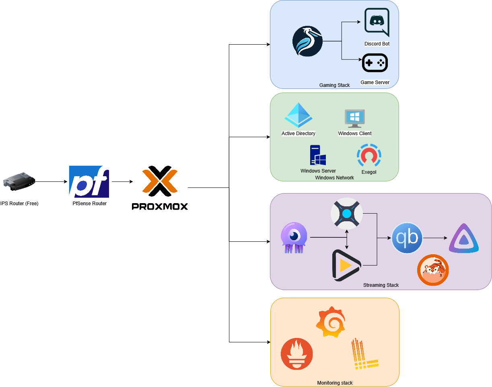

    

<h1 align="center">HomeLab V1</h1>

    <em>Welcome to my HomeLab journey! 🚀</em>

---

## 📝 Description

This repository documents the first version of my home lab server. Here you'll find dashboards, configuration files, and guides for every service I run.

> ⚠️ **Note:** This is a lab environment, not for production. Review each service before deploying to your own HomeLab.

---

## 🖥️ Hypervisor

I'm currently using [Proxmox](https://www.proxmox.com/en/) — open source, simple, and license-free unless you need support.

---

## 🛠️ Services

| Service | Description |
|---------|-------------|
| [Pterodactyl](https://pterodactyl.io/) | Host game servers (Minecraft, Discord bots, etc.) |
| [Grafana](https://grafana.com/) | Unified metrics & logs dashboard. See my dashboards [here](https://github.com/DrTableBasse/HomeLabV1/tree/master/Grafana/Dashboard). |
| [Jellyfin](https://jellyfin.org/) | Personal Netflix-like media server. |
| [Active Directory + Windows 10/11](https://learn.microsoft.com/en-us/windows-server/identity/ad-ds/get-started/virtual-dc/active-directory-domain-services-overview) | Test GPOs, AD hacks, and info gathering. Recommended: [GOAD Repository](https://github.com/Orange-Cyberdefense/GOAD). |
| [Docker](https://www.docker.com/) | Containerization platform. [Intro video](https://www.youtube.com/watch?v=_dfLOzuIg2o). |
| [LXC](https://linuxcontainers.org/) | Lightweight Linux containers, Docker alternative. |
| [PfSense](https://www.pfsense.org/) | Virtualized router/firewall. |
| [Cadvisor](https://github.com/google/cadvisor) | Container monitoring tool. |

---

## 🚀 Future Plans

- Automate deployments with **Terraform**, **Ansible**, **Packer**, and more.
- Build an isolated network for pentesting and team skill improvement.

---

## 🌐 Network Schema

Below is a simple diagram of my network and services:

    

---

## 🖥️ Hardware

### GMKtec Mini PC Gaming M7

- **CPU:** AMD Ryzen 7 Pro 6850H (8 cores / 16 threads, up to 4.70GHz)
- **RAM:** 32GB DDR5
- **Storage:** 1TB PCIe SSD
- **Networking:** Dual 2.5G LAN ports
- **Ports:** Dual USB4, HDMI 2.1, USB-C

This compact and powerful mini PC serves as the backbone of my HomeLab, providing enough resources for virtualization, containerization, and network services.